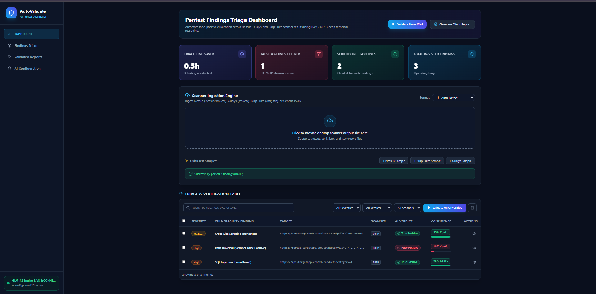
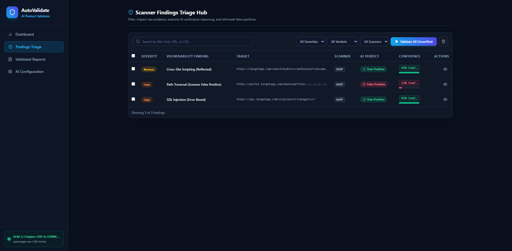
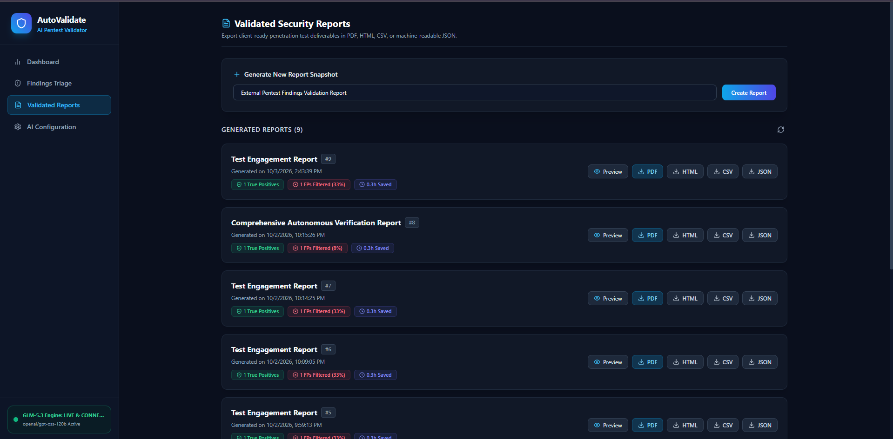
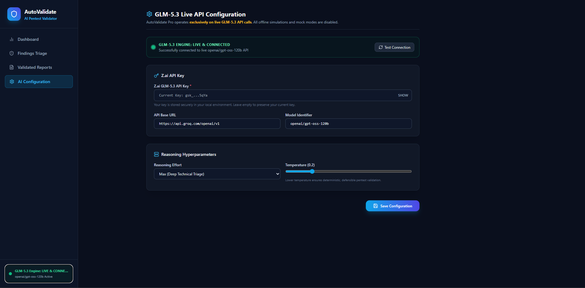
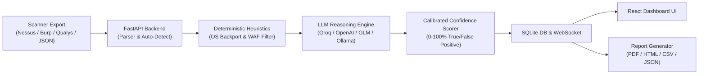

# AutoValidate Pro 🛡️
### AI-Powered Penetration Testing Scanner Findings Validator

[](https://www.python.org/)
[](https://fastapi.tiangolo.com)
[](https://react.dev/)
[](https://www.typescriptlang.org/)
[](https://vitejs.dev/)
[](https://tailwindcss.com/)
[](LICENSE)

**AutoValidate Pro** is an automated triage and validation platform for penetration testers, security engineers, and bug bounty hunters. It ingests automated scanner exports (**Nessus**, **Qualys VMDR**, **Burp Suite**, and **Generic JSON**), applies deep LLM reasoning alongside deterministic evidence heuristics, eliminates false positives (saving 40–60% of manual triage time), and exports executive and technical reports in **PDF**, **HTML**, **CSV**, and **JSON**.

---

## ⚡ Key Capabilities

* **Multi-Scanner Ingestion & Auto-Detection**:
  * **Nessus**: `.nessus` (XML) and CSV exports.
  * **Qualys VMDR**: XML and CSV exports.
  * **Burp Suite**: XML and JSON issue exports.
  * **Generic JSON**: Universal format for custom tools.
  * Automatic parser selection based on file contents.

* **Multi-Provider LLM Validation Engine (OpenAI-Compatible)**:
  * Works out of the box with **Groq**, **OpenAI (GPT-4o)**, **GLM-5.3 (Z.ai)**, **DeepSeek**, or **100% offline Local LLMs (Ollama / LM Studio)**.
  * Context-aware prompt evaluation assessing technical feasibility, environmental viability, and proof authenticity.

* **Deterministic Pentest Heuristics**:
  * **OS Backport Detection**: Automatically flags false alarms where scanners identify outdated upstream version banners on Debian, Ubuntu, or RHEL systems that already have backported security fixes.
  * **WAF & Perimeter Block Detection**: Differentiates between real exploit execution and perimeter blocks (HTTP 403 / Cloudflare / WAF custom responses).

* **Calibrated Confidence Scoring (0–100%)**:
  * $\ge 75\%$: **Verified True Positive** (Confirmed vulnerability, client-ready).
  * $40\% - 74\%$: **Needs Manual Review** (Plausible or ambiguous context).
  * $< 40\%$: **Filtered False Positive** (Version guess, backported patch, or WAF block).

* **Executive & Technical Reporting**:
  * **Interactive HTML**: Dark-themed dashboard with KPI summary and remediation steps.
  * **Client PDF**: Polished executive report ready for stakeholders.
  * **Spreadsheet CSV**: Clean data for tracking and auditing.
  * **JSON Export**: Integration with DefectDojo, Jira, and SIEM pipelines.

* **Real-Time Cybersecurity Dark UI**:
  * Real-time WebSocket progress tracking during bulk triage.
  * Side-by-side modal displaying raw scanner evidence alongside AI reasoning.

---

## 📸 Interface & Live Workflow

| Triage Dashboard | Scanner Findings Hub |
| :---: | :---: |
|  |  |
| *Real-time KPI metrics, auto-detect dropzone, and live triage* | *Filterable verification table with confidence scores & verdicts* |

| Validated Security Reports | Live AI Configuration |
| :---: | :---: |
|  |  |
| *One-click export to PDF, HTML, CSV, and machine JSON* | *Plug-and-play Groq, OpenAI, GLM-5.3, or local Ollama LLMs* |

---

## 🏗️ System Architecture



---

## 🚀 Installation & Quick Start

### 1. Prerequisites
* **Python 3.11+**
* **Node.js 18+** and **npm**

### 2. Clone Repository & Setup Environment
```bash
git clone https://github.com/zxainz/AutoValidate.git
cd AutoValidate

# Copy the environment template
copy .env.example .env
```

### 3. Backend Setup
```powershell
# Install Python dependencies
pip install -r backend\requirements.txt

# Launch FastAPI backend
python -m uvicorn backend.main:app --host 127.0.0.1 --port 8000
```
Backend API and Swagger docs will be live at: `http://127.0.0.1:8000/docs`

### 4. Frontend Setup
Open a second terminal window:
```powershell
# Navigate to frontend and install packages
cd frontend
npm install

# Start Vite dev server
npm run dev
```
Open **`http://localhost:3000`** in your browser.

---

## 🔑 LLM API Configuration

AutoValidate Pro uses the standard OpenAI-compatible `/chat/completions` protocol. You can configure your provider either via the **Settings page in the web UI** or directly in your `.env` file:

### Provider Presets

#### Option 1: Groq (Recommended — Ultra-Fast & Free Tier Available)
```env
ZAI_API_KEY=gsk_your_groq_api_key
ZAI_BASE_URL=https://api.groq.com/openai/v1
MODEL_NAME=openai/gpt-oss-120b
```
*(Also supports `qwen/qwen3.8-27b`, etc.)*

#### Option 2: OpenAI
```env
ZAI_API_KEY=sk-your_openai_api_key
ZAI_BASE_URL=https://api.openai.com/v1
MODEL_NAME=gpt-4o
```

#### Option 3: GLM-5.3 via Z.ai
```env
ZAI_API_KEY=your_zai_api_key
ZAI_BASE_URL=https://api.z.ai/api/coding/paas/v4
MODEL_NAME=glm-5.3
```

#### Option 4: Local & 100% Offline (Ollama)
```env
ZAI_API_KEY=ollama
ZAI_BASE_URL=http://localhost:11434/v1
MODEL_NAME=llama3
```

> **Tip**: You can test connectivity and change models anytime directly in the web UI under **Settings** ➔ **Test Connection**.

---

## 🧪 Testing With Sample Scans

Pre-built sample scans are included in `backend/sample_scans/` for immediate testing:
* `nessus_sample.xml`: Network scan with Apache version guessing and backported patch scenarios.
* `burp_sample.json`: Web application scan containing SQLi, XSS, and WAF-blocked path traversal.
* `qualys_sample.xml`: Vulnerability management export.
* `generic_sample.json`: Universal vulnerability schema.

### Running Automated Tests
Run the automated pytest test suite:
```powershell
python -m pytest backend\tests -v
```
All 16 unit and integration tests verify XML/JSON parsers, heuristics, confidence formulas, and API endpoints.

---

## 🐳 Docker Deployment

To launch the full stack with Docker Compose:
```bash
docker compose up -d --build
```
* **Frontend**: `http://localhost:3000`
* **Backend API**: `http://localhost:8000`

---

## 🛡️ Security & Safe GitHub Push

> [!WARNING]
> **NEVER COMMIT YOUR `.env` FILE!** 
> Your `.env` contains your private API keys. AutoValidate Pro comes with a hardened `.gitignore` that automatically excludes `.env`, `backend/.env`, and local database files.

### Steps to Push to GitHub:
```powershell
# 1. Initialize git repository
git init

# 2. Verify git status to ensure .env is NOT listed
git status

# 3. Stage and commit tracked files
git add .
git commit -m "feat: initial commit of AutoValidate Pro"

# 4. Link your GitHub remote and push
git branch -M main
git remote add origin https://github.com/<your-username>/<repo-name>.git
git push -u origin main
```

---

## ⚖️ Ethical & Legal Disclaimer
AutoValidate Pro is designed exclusively for authorized penetration testing, professional vulnerability assessments, and defensive security auditing within authorized scopes. Ensure all activities strictly comply with applicable laws and rules of engagement.
